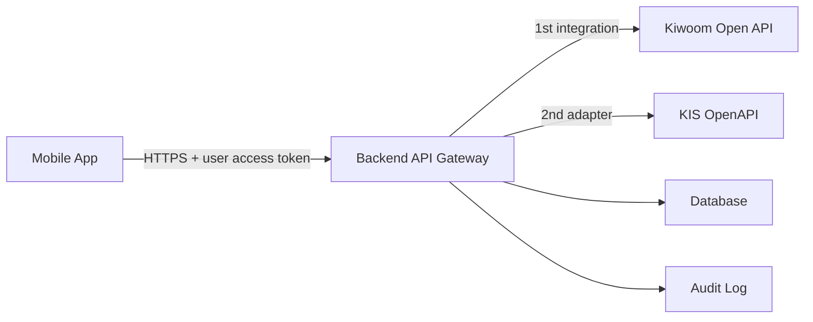
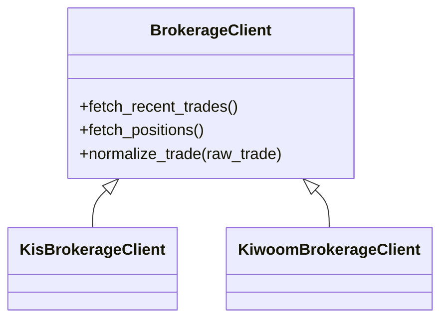

# 투자 매매일지 앱 초기 설계

> 현재 장기 운영 구조와 프론트엔드 이관 기준은 [long-term-architecture.md](long-term-architecture.md)를 기준으로 합니다. 이 문서는 초기 매매일지/증권사 연동 설계 기록입니다.

작성일: 2026-05-07

## 1. 설계 목표

이 앱은 개인 투자자가 국내/미국 주식 매매를 기록하고, 자신의 투자 판단을 복기할 수 있게 돕는 모바일 중심 투자 일지 앱이다. 단순 손익 조회가 아니라 매수 근거, 매도 근거, 전략, 감정, 원칙 준수 여부, 체결 품질을 함께 기록해 투자 습관을 개선하는 것이 핵심이다.

증권사 연동은 보안을 위해 모바일 앱에서 직접 수행하지 않는다. 모바일 앱은 자체 백엔드 API만 호출하고, 증권사 API 키와 민감한 인증 정보는 백엔드에서만 관리한다.

## 2. 확정 방향

- 타겟: 모바일 앱 우선
- 연동 방식: 경로 C, 증권사 API 직접 연동
- 첫 연동 증권사: 키움증권 Open API
- 후속 연동 증권사: 한국투자증권 OpenAPI
- 서버 구조: 모바일 앱 -> 백엔드 API Gateway -> 증권사 API
- 백엔드 우선 스택: Python FastAPI
- 초기 모바일 통신: JavaScript fetch 기반 API 클라이언트
- 인증 권장안: Supabase Auth 또는 동등한 JWT 기반 인증
- 데이터베이스 권장안: PostgreSQL
- ORB 기본값: 5분 Opening Range

## 3. 3-Tier 아키텍처



### 모바일 앱

- 사용자의 로그인 상태와 화면 렌더링을 담당한다.
- 증권사 API 키, 앱 시크릿, 계좌 인증 정보를 저장하지 않는다.
- 백엔드에서 정규화된 거래 데이터만 받아 표시한다.

### 백엔드 API Gateway

- 사용자 인증을 검증한다.
- 사용자별 증권사 연결 정보를 안전하게 참조한다.
- 증권사별 원천 응답을 공통 데이터 모델로 변환한다.
- 민감 정보 마스킹, 요청 제한, 감사 로그를 담당한다.

### 증권사 API Adapter

- 키움증권을 첫 구현 대상으로 삼고, 한국투자증권은 같은 인터페이스를 따르는 후속 Adapter로 추가한다.
- 내부 서비스에는 같은 형태의 `NormalizedTrade`를 반환한다.
- 증권사별 장애와 응답 지연을 격리한다.

## 4. 보안 원칙

1. 모바일 앱에는 증권사 API 키를 넣지 않는다.
2. API 키, 앱 시크릿, 계좌 토큰은 환경 변수 또는 Secret Manager에 저장한다.
3. 모바일 앱과 백엔드는 반드시 HTTPS로 통신한다.
4. 백엔드는 사용자 인증 토큰을 검증한 뒤에만 증권사 요청을 수행한다.
5. 로그에는 API 키, 계좌번호, 토큰, 주민번호성 식별자를 남기지 않는다.
6. 증권사 원천 응답은 필요한 필드만 정규화해서 저장한다.
7. 모든 증권사 조회/동기화 요청은 감사 로그에 남긴다.

## 5. 초기 API 계약

### Health Check

```http
GET /
```

응답:

```json
{
  "message": "매매일지 백엔드 서버가 정상 작동 중입니다."
}
```

### 최근 매매 내역 조회

```http
GET /api/v1/trades
Authorization: Bearer <access_token>
```

응답:

```json
{
  "status": "success",
  "data": [
    {
      "trade_id": "mock-001",
      "broker": "KIWOOM",
      "market": "KRX",
      "ticker": "005930",
      "name": "삼성전자",
      "side": "BUY",
      "order_type": "LIMIT",
      "trade_date": "2026-05-07",
      "trade_time": "09:05:12",
      "price": 80000,
      "quantity": 10,
      "gross_amount": 800000,
      "fee": 120,
      "tax": 0,
      "currency": "KRW",
      "source_order_id": "kiwoom-mock-order-001",
      "source_execution_id": "kiwoom-mock-exec-001",
      "strategy": "ORB",
      "journal_required": true
    }
  ]
}
```

### 포트폴리오 조회

```http
GET /api/v1/portfolio
Authorization: Bearer <access_token>
```

키움 `kt00018`을 호출해 현재 잔고와 보유종목을 앱 화면용으로 정규화한다.

### 매매일지 원천 데이터 조회

```http
GET /api/v1/journal/source-trades
Authorization: Bearer <access_token>
```

키움 `ka10170`과 `kt00007`을 함께 사용해 당일 매매 요약과 주문/체결 상세를 반환한다. 이 응답을 기반으로 사용자가 복기해야 할 매매일지 초안을 생성한다.

### 키움 데이터 동기화

```http
POST /api/v1/sync/kiwoom
Authorization: Bearer <access_token>
```

키움 `kt00018`, `ka10170`, `kt00007`을 조회해 로컬 DB에 포트폴리오 스냅샷과 매매일지 초안을 저장한다. 로컬 MVP는 SQLite를 사용하고, 운영 배포 시 PostgreSQL로 전환한다.

### 매매일지 초안 조회

```http
GET /api/v1/journal/drafts
Authorization: Bearer <access_token>
```

동기화된 원천 거래 데이터를 기반으로 복기해야 할 매매일지 초안 목록을 반환한다.

## 12. 로컬 저장소

로컬 MVP는 별도 DB 서버 없이 `sqlite3` 기반 `investment_journal.sqlite3`에 동기화 결과를 저장한다.

저장 테이블:

- `sync_runs`: 키움 동기화 실행 이력
- `portfolio_snapshots`: 동기화 시점의 포트폴리오 요약과 보유종목
- `journal_drafts`: 복기가 필요한 매매일지 초안

운영 배포에서는 PostgreSQL로 전환한다. 테이블 개념은 유지하되, 사용자 ID, 계좌 별칭, 암호화 키 관리, 감사 로그를 추가한다.

## 6. 정규화 거래 데이터 모델

증권사별 원천 데이터는 서로 다르므로 백엔드 내부에서는 다음 공통 모델로 변환한다.

```text
NormalizedTrade
- trade_id
- user_id
- broker
- account_alias
- market
- ticker
- name
- side: BUY | SELL
- order_type: MARKET | LIMIT | STOP | ETC
- trade_date
- trade_time
- price
- quantity
- gross_amount
- fee
- tax
- currency
- source_order_id
- source_execution_id
- raw_hash
```

## 7. ORB 및 퀀트 매매일지 필수 기록 필드

ORB(Open Range Breakout)나 퀀트 전략을 수행한다면 단순 매수/매도 기록만으로는 복기가 어렵다. 아래 필드를 거래 일지에 포함하는 것을 권장한다.

### 전략 컨텍스트

- strategy_name: ORB, momentum, mean_reversion 등
- setup_name: 5분 ORB, 15분 ORB 등
- signal_time: 진입 신호 발생 시각
- entry_time: 실제 진입 시각
- exit_time: 실제 청산 시각
- planned_entry_price
- actual_entry_price
- planned_stop_price
- planned_target_price
- actual_exit_price

### 체결 품질

- slippage_amount: 실제 체결가와 의도 가격의 차이
- slippage_rate
- spread_at_entry
- spread_at_exit
- partial_fill 여부
- order_latency_ms
- execution_strength
- volume_at_entry
- opening_range_high
- opening_range_low
- breakout_price

### 리스크 관리

- risk_per_trade
- position_size_rule
- planned_loss_amount
- actual_loss_amount
- reward_risk_ratio
- max_adverse_excursion
- max_favorable_excursion
- stop_followed 여부

### 복기 데이터

- entry_reason
- exit_reason
- rule_violations
- emotion_tags
- chart_snapshot_url
- lesson

### ORB 기본 정책

- 기본 Opening Range: 장 시작 후 5분
- 진입 기준: Opening Range 상단 돌파
- 손절 기준: Opening Range 하단 또는 사전 정의한 리스크 금액
- 기록 필수: 신호 발생 시각, 실제 진입 시각, 돌파 가격, 실제 체결가, 슬리피지, 손절 준수 여부
- 설정 가능 항목: 5분/15분/30분 기준, 분할 진입 여부, 거래대금 필터, 갭 상승/하락 필터

## 8. 증권사 Adapter 설계

```text
BrokerageClient
- get_access_token()
- fetch_recent_trades()
- fetch_positions()
- fetch_balance()
- normalize_trade(raw_trade)
```

키움증권을 `KiwoomBrokerageClient`로 먼저 구현한다. 한국투자증권은 후속으로 `KisBrokerageClient`를 추가한다. 모바일 앱과 서비스 계층은 특정 증권사 구현을 직접 알지 않는다.



### 키움증권 우선 구현 범위

1. 키움 인증/토큰 관리
2. 체결 내역 조회
3. 잔고/보유 종목 조회
4. 수수료/세금 포함 정규화
5. 중복 체결 방지를 위한 `source_execution_id` 저장
6. 장애 발생 시 마지막 정상 동기화 시각 표시

## 9. 모바일 화면 초기 흐름

1. 사용자가 앱 로그인
2. 홈 화면에서 최근 동기화 상태 확인
3. `매매내역 불러오기` 실행
4. 모바일 앱이 백엔드 `/api/v1/trades` 호출
5. 백엔드가 사용자 인증 후 키움증권 API 조회
6. 백엔드가 정규화된 거래 데이터를 반환
7. 모바일 앱이 아직 일지 미작성 거래를 강조 표시
8. 사용자가 진입 근거, 청산 근거, 감정, 원칙 준수 여부를 작성

## 10. MVP 구현 순서

1. FastAPI 백엔드 기본 구조
2. 모바일 API 클라이언트
3. Mock 거래 데이터 기반 화면 개발
4. 정규화 거래 모델 확정
5. 사용자 인증 도입
6. 키움증권 Adapter PoC
7. 거래 동기화 및 중복 방지
8. 잔고/보유 종목 동기화
9. 매매일지 작성 화면
10. 전략/감정/원칙별 성과 분석

## 11. 권장 결정 사항

- 첫 연동 증권사: 키움증권
- 후속 연동 증권사: 한국투자증권
- 로그인 방식: Supabase Auth 권장. 단, 백엔드는 반드시 JWT를 검증하고 모바일 토큰만 신뢰하지 않는다.
- 데이터베이스: PostgreSQL 권장
- 거래 데이터 저장 범위: 정규화 데이터는 저장하고, 원천 응답은 전체 저장하지 않는다. 대신 중복 방지와 감사 추적을 위해 원천 응답의 해시와 증권사 체결 ID를 저장한다.
- ORB 전략 기준 시간: 5분을 기본값으로 두고, 15분/30분은 사용자 설정으로 제공한다.
- Secret 관리: 로컬은 `.env`, 배포는 클라우드 Secret Manager 또는 Supabase Vault 같은 관리형 Secret 저장소를 사용한다.
- 배포 방식: 초기 MVP는 Docker 기반 FastAPI API 서버 + PostgreSQL 조합을 권장한다.

키움증권 연동 세부 운영 조건은 [kiwoom-integration.md](kiwoom-integration.md)에 별도로 정리한다.
