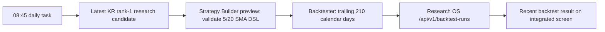

# Daily Strategy Validation Automation

- Author: Codex (`automation-integrator`)
- Status: Implemented
- Created/updated: 2026-08-13
- Authoritative path: `docs/design/daily-strategy-validation-automation.md`

## Objective

Run the integrated Strategy Design and Validation workflow once per Korean calendar day, store the latest simulation result in Research OS, and never place a live order.

## Workflow



## Operational contract

- Scheduled task: `InvestmentResearchOS-DailyStrategyValidation-0845`.
- Daily time: 08:45 KST, after the 08:00 recommendation generation and 08:30 market-journal task.
- Catch-up: Task Scheduler `StartWhenAvailable` runs the missed task after the next sign-in/startup opportunity.
- Idempotency: a successful result is produced at most once per local calendar day unless an operator passes `-Force`.
- Retry: a failed task may retry twice at 15-minute intervals; a successful retry remains protected by the daily idempotency state.
- Target: newest valid Korean rank-1 daily recommendation. Missing evidence fails closed instead of silently substituting a ticker.
- Design validation: compile/preview only; no generated strategy source file is persisted.
- Simulation: `sma_crossover` with 5/20 periods, local Lean backtester, and explicit commission/tax assumptions. The shorter pair matches the integrated screen's established baseline and reduces zero-trade validation runs.
- Result: a secret-free summary is stored in the Research OS backtest history shown by the integrated screen.
- Credential: read at runtime from Windows Credential Manager; never embedded in the task command or state file.
- Safety: the runner has no call to Strategy Builder's execution/order endpoint and never sends a brokerage order.

## Failure states

- Missing recommendation, unavailable local service, unavailable Docker/Lean image, market-data failure, authentication failure, and Research OS persistence failure all produce a non-zero task result.
- State and logs are written under ignored `tmp/` paths. They contain no access token or account data.
- If a service is unavailable, the runner may start the existing integrated workbench and waits up to four minutes for health checks.

## Verification

Run:

```powershell
powershell.exe -NoProfile -ExecutionPolicy Bypass -File tools\check_daily_strategy_validation_task.ps1 -Json
```

The check must report a registered task, a safe command, `start_when_available: true`, a configured credential, and no live-order call in the latest state.
