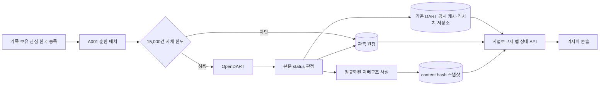

# DART 사업보고서 분석 랩 통합 설계

- 상태: M2 지배구조 정형 스냅샷 활성 · M3/M4 예정
- 작성/갱신: 2026-09-20
- 기준 경로: `D:\workspace\InvestmentJournalApp`

## 목적

가족 보유 종목과 관심 종목 가운데 한국 상장 종목의 사업보고서(A001)를 기존 투자 리서치 콘솔에서 관측하고, DART 오류·수집 누락·쿼터 위험을 숨기지 않는 로컬 분석 작업공간을 제공한다.

## 목표

- OpenDART 응답의 HTTP 코드와 본문 `status`를 별도로 기록한다.
- 인증키 값과 전체 요청 파라미터는 원장·화면·로그에 저장하지 않는다.
- 공식 안내 기준 20,000건의 75%인 15,000건에서 플랫폼 요청을 선제 차단한다.
- 최근 30일 동안 실행 기록이 없는 날을 `NO RUN`으로 명시한다.
- 기존 가족 보유·관심 한국 종목과 기존 DART 공시 저장소를 그대로 재사용한다.
- 최대주주·임원·직원·주식총수·배당·보수 API는 원문 대신 정규화된 공개 사실과 content hash만 보관한다.
- 화면 본문과 API 응답에 출처·책임 제한·비권유 고지를 둔다.

## 비목표

- 실시간 매매 신호, 자동 주문, 계좌 변경, 외부 메시지 발송을 하지 않는다.
- 검증 수단이 없는 종합 점수나 종목 랭킹을 만들지 않는다.
- KOSPI200/KOSDAQ150을 부정확한 시가총액 프록시로 대체하지 않는다.
- 이번 단계에서 사업보고서 원문 전체 파싱이나 지배구조 정형 API 전 항목을 활성화한 것으로 표시하지 않는다.
- API 원본 응답, 요청 URL, 요청 파라미터, 인증키를 신규 스냅샷 저장소에 보관하지 않는다.

## 데이터 흐름

## 인터페이스

- `GET /api/v1/dart/annual-report-lab/status`
  - 환경 진단, 쿼터 원장, 정책 자가검증, 30일 이력, 최근 실패, 수집 커버리지와 단계 상태를 반환한다.
- `POST /api/v1/dart/annual-report-lab/refresh`
  - 가족 보유·관심 한국 종목을 커서 기반의 제한된 묶음으로 조회한다.
  - `pblntf_detail_ty=A001`, `last_reprt_at=Y`를 사용한다.
- `POST /api/v1/dart/annual-report-lab/governance/refresh`
  - 최신 사업연도 사업보고서(`11011`)의 정규화 지배구조 스냅샷을 최대 2개 종목씩 갱신한다.
  - 최대주주/변동, 임원, 직원, 주식총수, 배당, 이사·감사 보수 API의 HTTP·본문 status를 기존 원장에 기록한다.
  - 동일한 공개 사실은 content hash 기준으로 중복 저장하지 않는다.

## 단계

1. 활성: A001 색인, 쿼터 차단, 실행/오류 원장, 정책 자가검증, 콘솔 상태 화면.
2. 활성: 최대주주·변동, 임원, 직원, 주식총수, 배당, 이사·감사 보수의 정규화 스냅샷. 원문·원본 JSON은 저장하지 않는다.
3. 예정: `II. 사업의 내용` 원문 파싱, 연도 간 문구 diff, 위험 키워드 추이.
4. 예정: 명시적 불리언 필터 기반 비교·스크리닝. 종합 점수와 랭킹은 제외.

## 실패 상태

- 키 미설정: 환경 진단에 `설정 필요`, 외부 호출 없이 배치 `skipped` 기록.
- HTTP 오류: `http_err`로 기록.
- HTTP 200 + DART 오류 상태: `dart_err`로 기록.
- `013`: 오류가 아니라 `empty`로 기록.
- 자체 한도 도달: 네트워크 호출 전에 `quota_stopped`로 기록하고 남은 배치를 중단.
- 실행 기록 부재: 30일 이력의 해당 날짜를 회색 `NO RUN`으로 표시.
- 정형 API 일부 실패: 성공·빈 결과 항목만 스냅샷에 남기고 상태를 `partial_success`로 표시한다. 전 항목 실패는 스냅샷으로 저장하지 않고 다음 제한 배치에서 재시도한다.

## 검증 기준

- 잘못된 키 응답이 HTTP 200이어도 `dart_err`가 된다.
- `013`은 정상적인 빈 결과로 분류된다.
- 15,001번째 요청은 네트워크 전에 차단된다.
- SQLite 원장 바이트에 실제 인증키가 존재하지 않는다.
- 지배구조 스냅샷 테이블에 원본 응답·요청 URL·요청 파라미터 컬럼이 없다.
- 정규화 필드에 출생연월·상세 경력 등 리서치 목적에 불필요한 임원 원문 필드는 없다.
- 콘솔은 데스크톱과 390x844에서 가로 넘침 없이 읽힌다.
- 기존 DART 감시·리서치 저장과 테스트가 회귀하지 않는다.
