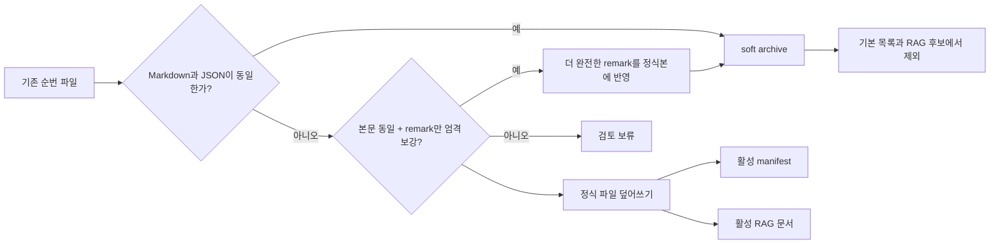

# DART 공시 저장 멱등성 및 중복 보관 정책

- 상태: 적용
- 갱신일: 2026-08-27
- 기준 경로: `D:\workspace\InvestmentJournalApp`

## 목적

같은 OpenDART 접수번호를 강제 재조회하더라도 활성 리서치 원본과 검색 인덱스가 한 건으로 유지되게 한다.

## 문제

기존 공시 저장은 동일 파일명이 이미 있을 때 순번 접미사를 붙였다. 따라서 강제 재조회가 같은 접수번호의 Markdown·JSON 쌍과 RAG 문서를 누적할 수 있었다. 이는 공식 원문이 여러 개인 것처럼 보이게 하고 로컬 저장소와 검색 후보를 불필요하게 키운다.

## 목표

- `(티커, 접수번호)`마다 활성 DART 공시 원본을 하나만 유지한다.
- 새 강제 재조회는 접수번호 기반의 정식 파일을 덮어쓴다.
- 기존의 내용이 완전히 동일한 중복본은 삭제하지 않고 `archived` 메타데이터로 보관한다.
- 활성 매니페스트와 RAG 검색 인덱스는 정식 원본만 가리킨다.
- 일일 리서치 운영 작업이 최근 36시간에 갱신된 DART 종목 중 최신 12개만 로컬 중복 정리하고 결과 상태를 남긴다.

## 비목표

- 공시 원문·사용자 파일의 하드 삭제 또는 외부 DART API 호출 추가
- 공시 알림만으로 팀 리포트, 매매 전략, 체크리스트를 자동 완성하는 것
- 주문·계좌·텔레그램 전송 동작 변경

## 안전 계약

- 정식 파일이 없거나 내용 해시가 다르면 자동 보관하지 않고 결과에 `검토 보류`로 남긴다.
- 예외적으로 Markdown이 바이트 단위로 같고, JSON의 다른 모든 필드가 같으며, DART `filing.remark`만 기존 값의 엄격한 접두 확장(예: `코` → `코정`)인 경우에만 더 완전한 JSON을 정식본에 원자적으로 반영한 뒤 보관한다. 순번본 JSON도 모두 같은 바이트여야 하며, 그 외 차이는 자동 병합하지 않는다.
- 보관본은 파일을 지우지 않는다. JSON과 매니페스트에 `status=archived`, `is_deleted=true`, 보관 사유·시각을 기록한다.
- 보관 전 정식 원본을 RAG에 upsert하고, 보관 후보의 RAG 경로만 제거한다.
- 매일 실행은 로컬 파일·SQLite·매니페스트만 다루며 외부 호출, LLM 호출, 주문, 메시지 전송을 하지 않는다.

## 검증

- 단위 테스트는 같은 접수번호의 정식본·순번본에서 활성 1건, 보관 1건, RAG 1건을 확인한다.
- 실제 저장소에는 먼저 종목 단위 dry-run을 실행한 뒤, 적용 후 재실행에서 후보가 0건인지 확인한다. 전체 이력 점검은 명시적 `--all`에서만 수행한다.
- `run_daily_research_operations.ps1`는 리서치 소스 갱신 뒤 최근 36시간·최대 12종목 범위의 정리를 실행하며 실패는 기존 작업 로그에 남긴다. 전체 이력 스캔은 명시적 `--all`에서만 수행한다.
