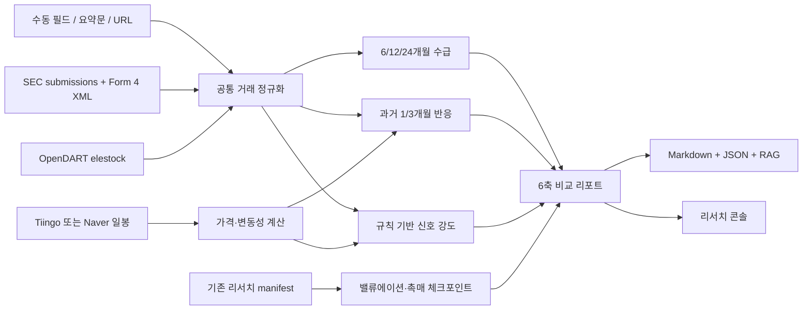

# 내부자거래 비교 리서치 파이프라인

- 작성자: Codex
- 상태: 구현 및 로컬 검증 완료
- 생성일: 2026-09-12
- 기준 경로: `D:\workspace\InvestmentJournalApp`

## 목표

미국 SEC Form 4와 한국 OpenDART 임원·주요주주 소유보고를 하나의 데이터 계약으로 정규화하고, 모든 주식 종목에 동일한 여섯 축의 근거 중심 리서치를 제공한다.

## 비목표

- 매수·매도 주문 실행 또는 주문 추천
- 내부자 거래만으로 종목 순위를 자동 확정
- 확인되지 않은 거래가격, 거래금액, 10b5-1 여부, 밸류에이션 수치 추정
- 보조 사이트를 공식 공시와 같은 신뢰도로 취급

## 사용자 흐름

1. 사용자는 티커와 선택적 구조화 필드, 공시 URL 또는 텍스트 요약을 입력한다.
2. 시스템은 미국 종목이면 SEC Form 4, 한국 종목이면 OpenDART 소유보고를 우선 조회한다.
3. 거래를 공통 스키마로 정규화하고 가격 이력과 저장된 리서치 근거를 연결한다.
4. 거래 맥락, 가격·변동성, 내부자 수급, 신호 강도, 역사적 반응, 투자 체크포인트를 동일한 순서로 출력한다.
5. 사용자가 저장을 선택하면 Markdown·JSON·RAG 색인을 함께 갱신한다.
6. 기존 일일 운영 루틴은 가족 전체 보유·관심종목을 순환 점검하되 주문·외부 메시지는 실행하지 않는다.

## 데이터 흐름

## 공통 거래 계약

핵심 식별 필드는 `ticker`, `market`, `tx_date`, `tx_code`, `source_type`이다. 공식 공시에서 수집한 거래는 `source_url`도 필수로 보존하고, 수동 입력은 URL이 없다는 사실을 `확인 필요`로 명시한다. `insider_name`, `title`, `relationship`, `shares`, `avg_price`, `post_shares`, `is_10b5_1`는 원문이나 사용자 입력에서 확인될 때만 채운다. 누락값은 `확인 필요`로 노출하며 0으로 대체하지 않는다.

미국 거래코드는 SEC Form 4 코드를 그대로 보존한다. 한국 OpenDART는 보고된 주식수 증감을 `ACQUIRE` 또는 `DISPOSE`로 정규화하되 원문 필드도 함께 저장한다. 한국 소유보고 API에 거래단가가 없으면 금액을 계산하지 않는다.

## 신뢰·보안 경계

- 1차 근거: `sec.gov`, `data.sec.gov`, `dart.fss.or.kr`, `opendart.fss.or.kr`
- 2차 참고: 사용자가 명시한 `secform4.com`, `marketbeat.com`
- URL은 HTTPS와 허용 호스트만 받으며 로컬/사설 주소, URL 자격증명, 임의 리디렉션 대상은 거부한다.
- SEC 요청은 식별 가능한 User-Agent와 초당 10회 미만의 직렬 호출을 사용한다.
- API 키·계좌·수량·인증정보는 리포트와 로그에 기록하지 않는다.
- 분석 저장과 조회는 사용자 토큰으로 보호된 기존 API 경계를 따른다.

## 운영 기준

- 일일 자동화는 전체 가족 보유·관심 주식 범위를 순환 처리하고 진행률과 미확인 원인을 상태 파일에 남긴다.
- 공시가 없으면 정상 `no_events`, 데이터 공급자 실패는 `source_unavailable`, 티커 형식이 아닌 포트폴리오 라벨 등 분석 대상 밖 후보는 `not_applicable`로 구분한다.
- 부분 수집으로 24개월 전체를 덮지 못하면 수급 합계를 완전한 값으로 표현하지 않는다.
- 가격 이력이 없으면 가격 위치·변동성·사후 반응은 `확인 필요`로 남겨도 리포트 생성은 가능하다.
- 자동 결과는 리서치 초안이며 최종 투자 판단과 주문은 사람 검토 대상이다.

## 검증 기준

- SEC XML, OpenDART JSON, 한국어/영어 요약 입력의 고정 샘플 회귀 테스트
- 52주 위치, 1·3개월 변동성, 6·12·24개월 수급, 1·3개월 사후 수익률 계산 테스트
- URL 허용목록과 사설 주소 거부 테스트
- 인증 API 계약, 저장 파일/RAG 연결, 일일 운영 스크립트 정적 계약 테스트
- 데스크톱과 390x844에서 탭, 입력 폼, 6축 카드, 오류·빈 상태의 오버플로 검증

## 대안과 결정

- 보조 내부자거래 사이트만 크롤링하는 방식은 편하지만 원문 재현성과 이용조건이 불명확해 채택하지 않았다.
- 모든 종목의 24개월 Form 4를 매일 전량 재수집하면 요청량과 실행시간이 과도하다. 상태 캐시와 순환 점검을 사용하고 수집 범위를 리포트에 명시한다.
- 내부자거래 전용 OS 예약 작업을 추가하면 기존 20:20 운영 루틴과 중복된다. 기존 루틴에 한 단계를 결합한다.
