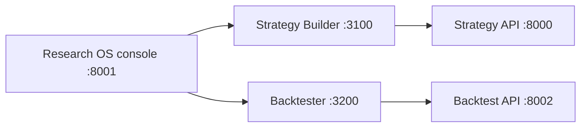

# Integrated Strategy Workbench

- Status: implemented
- Updated: 2026-07-12
- Authoritative root: `C:\Users\lib20\InvestmentJournalApp`

## Objective
Let a user move from holdings, family portfolios, news, earnings, and daily recommendations into strategy design and backtesting from one Research OS entry point.

## Boundaries
- Research OS owns the portal and research context.
- Strategy Builder and Backtester remain isolated local services so their Python and Next.js dependencies do not destabilize Research OS.
- The first integration milestone provides unified startup, navigation, health guidance, and stable URLs.
- Live orders, account mutation, deployment, and automatic trade submission are non-goals.

## Runtime

## Handoff contract
- Research OS sends only `ticker`, inferred `market`, and the `research-os` source label.
- Strategy Builder sends the ticker plus a size-limited URL-safe Base64 encoding of the current YAML strategy.
- Backtester validates ticker characters, payload characters, encoded length, decoded length, and the YAML strategy marker before importing.
- Account identifiers, holdings quantities, tokens, and brokerage credentials are never included.
- Strategy Builder and Backtester load into a named iframe inside the Research OS dashboard, so the normal workflow stays on one console page. Explicit new-tab links remain as a recovery path.
- The portal reads authenticated local port health for both frontends and APIs. A start-only control may invoke the fixed local launcher when a service is down; arbitrary commands, service termination, and live trading are excluded.

## Next milestone
Replace the URL-carried YAML with a short-lived local handoff identifier if strategies routinely exceed the current size guard, and add service health badges to the portal cards.
