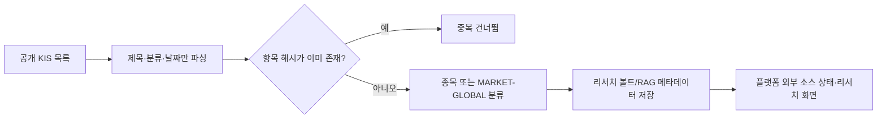

# 한국투자증권 공개 글로벌 리서치 목록 연동

- 상태: 운영 적용
- 작성일: 2026-09-20
- 대상: `D:\workspace\InvestmentJournalApp`

## 목표

한국투자증권의 공개 **독점 글로벌 리서치** 목록을 하루 한 번 확인해, 보유·관심종목 리서치와 시장 리서치 화면에서 출처가 분명한 메타데이터로 활용한다.

## 범위와 경계

- 수집: 공개 목록의 제목, 분류, 발행일, 표시된 작성 주체, 목록 URL.
- 저장하지 않음: 본문, 목록 요약(`body_sub`), PDF, 로그인 뒤 상세 페이지, 로그인 우회 데이터.
- 반영: 제목에 종목이 신뢰성 있게 식별될 때만 해당 종목의 `analyst_report`로 연결한다. 그 외에는 `MARKET-GLOBAL` 시장 리서치로 보관한다.
- 비목표: 매수·매도 신호 생성, 주문 호출, 한국투자증권 계정/세션 사용, PDF 자동 다운로드.

## 흐름

## 운영

- 실행 주체: 기존 Windows 작업 스케줄러 `InvestmentResearchOS-DailyResearchOperations-2020`.
- 시각: 매일 20:20 KST. `StartWhenAvailable`이므로 PC가 꺼져 있던 날은 다음 부팅 후 누락 실행을 시도한다.
- 중복 방지: `category + title + published_at` SHA-256 식별자로 이미 반영된 항목은 저장하지 않는다.
- 보관: `research_vault/_system/kis_global_research_cache.json`의 최근 300개 메타데이터 항목만 유지한다.
- 확인: `GET /api/v1/kis-global-research/status`, `POST /api/v1/kis-global-research/refresh`, `tools/check_kis_global_research_store.py --strict`.

## 장애·검증 기준

- 목록 HTTP 오류나 페이지 구조 변경은 캐시에 실패 시각·오류를 남기고 기존 성공 데이터는 보존한다.
- 성공 기준은 공개 목록 파싱, 중복 방지, 메타데이터 전용 정책, 로컬 저장 경로 검증이다.
- 원문 수치·판단이 필요할 때는 플랫폼 링크를 통해 사용자가 공식 원문을 직접 확인한다.
