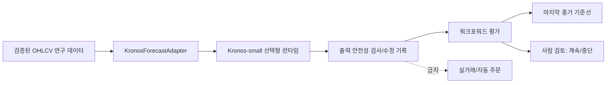

# Kronos 수치 예측 어댑터 도입 설계

- 상태: 1단계 구현
- 작성일: 2026-08-01
- 대상: `D:\workspace\InvestmentJournalApp`
- 목적: 기존 투자 리서치·백테스터를 바꾸지 않고 Kronos를 재현 가능한 수치 예측 실험으로 격리한다.

## 한 문장 목표

Kronos-small의 OHLCV 예측을 기존 연구 시스템의 보조 신호로만 평가하고, 기준선·출력 품질·시간 순서 누수를 확인한 뒤에만 다음 단계를 사람 검토로 넘긴다.

## 근거와 범위

Kronos 공식 저장소는 OHLCV 입력과 512개 컨텍스트의 `Kronos-small`을 제공하지만, 제공된 파인튜닝/백테스트 예제는 운영용 매매 시스템이 아닌 시연용이라고 명시한다. 따라서 이 단계는 모델 교체나 주문 연결이 아니다.

### 목표

- 선택형 `KronosForecastAdapter`로 모델 의존성을 기존 API에서 분리한다.
- OHLCV 필수 열, 시간 순서, 유한값, 음수 거래량을 실행 전에 검증한다.
- 512 컨텍스트를 넘으면 최신 구간만 사용한 사실을 진단 결과에 기록한다.
- 날짜 순서 기반 워크포워드 평가와 마지막 종가 기준선을 제공한다.

### 비목표

- 기본 LLM 또는 추천 모델 교체
- 실시간 추천·텔레그램 발송·키움/KIS 주문 연결
- 자동 매매, 포트폴리오 최적화, 수익률 보장
- 모델 가중치 학습·파인튜닝·외부 데이터 자동 다운로드

## 경계와 흐름



## 운영 규칙

1. Kronos 의존성은 `backend/requirements.txt`에 넣지 않는다. PyTorch와 모델 가중치는 별도 실험 환경에서만 설치한다.
2. `KronosForecastAdapter`는 `live_trading=False` 진단을 남기며, 현재 API·예약 작업·텔레그램 경로에서 호출하지 않는다.
3. 음수 `volume`/`amount`와 OHLC 순서 위반은 기본적으로 수정 내역을 남긴다. 엄격 평가에서는 `strict=True`로 해당 창을 실패시킨다.
4. 모든 평가는 시간 순서를 유지하고, 마지막 종가 기준선과 함께 기록한다. 데이터 셔플은 허용하지 않는다.
5. 기준선 대비 개선이 있어도 거래비용·슬리피지·시장충격·포트폴리오 제약을 반영하기 전에는 투자 의사결정에 사용하지 않는다.

별도 환경에서만 다음 선택 의존성을 설치한다. 현재 프로젝트의 기본 런타임과 섞지 않는다.

```powershell
python -m venv .venv-kronos
.\.venv-kronos\Scripts\python -m pip install -r backend\requirements-kronos.txt
# Kronos 저장소를 별도 경로에 두고 그 경로를 PYTHONPATH에 추가한 뒤 실험한다.
```

## 단계별 도입

| 단계 | 상태 | 통과 조건 | 사람 검토 |
| --- | --- | --- | --- |
| 1. 어댑터·단위 테스트 | 구현 | 입력/출력 검증, 컨텍스트 진단, 누수 없는 창 | 담당자 확인 |
| 2. 오프라인 데이터 평가 | 대기 | 여러 종목·기간에서 기준선, MAE, 방향성, 결측률 기록 | 데이터 출처·기간 승인 |
| 3. 페이퍼 리서치 신호 | 대기 | 비용·슬리피지·신호 지연 포함, 기존 신호와 비교 | 리스크 승인 |
| 4. 실거래 연결 | 금지 | 별도 설계·백테스트·롤백·명시적 승인 필요 | 반드시 수동 승인 |

## 검증 목표

- 필수 OHLCV 입력 오류는 모델 호출 전에 100% 차단한다.
- 미래 시점이 학습/컨텍스트에 섞이지 않는 워크포워드 창을 테스트한다.
- 모든 결과에 모델 식별자, 컨텍스트 잘림 수, 출력 수정 수, 기준선 지표를 남긴다.
- 실제 모델 가중치와 GPU 실행은 별도 환경에서 수동으로 검증한다. 현재 단계에서는 모델 다운로드 및 실시간 연결을 검증했다고 주장하지 않는다.

## 열린 문제

- 한국 주식 일봉/분봉의 거래량·금액 분포가 사전학습 분포와 맞는지 확인 필요
- 조정주가, 거래정지, 액면분할, 시장별 휴장일을 정규화할 데이터 계약 필요
- 다중 종목 신호를 포트폴리오로 변환할 위험 중립화·비용 모델 필요
