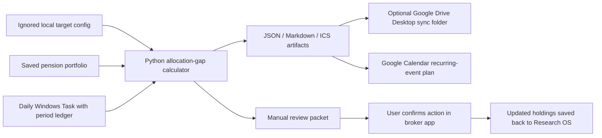

# Personal Pension Rebalancing Pipeline

- Author: Codex (`pension-rebalancing-safety-automation`)
- Status: Implemented locally; Google Calendar authorization pending
- Created/updated: 2026-08-29
- Authoritative path: `docs/design/pension-rebalancing-pipeline.md`

## Objective

Keep a personal pension account's target allocation, current allocation gap, monthly/quarterly review cadence, and research artifacts in one auditable workflow while keeping all broker orders manual.

## Goals

- Define the target allocation in an ignored local JSON config, never in a committed source file.
- Calculate current weights and target gaps from a saved portfolio's market values.
- Produce an idempotent monthly/quarterly Google Calendar event plan with reminders and an importable ICS fallback.
- Keep review JSON/Markdown reports in the local vault and optionally copy them into a Google Drive Desktop sync directory.
- Version the implementation, tests, and design contract in GitHub.
- Recover missed monthly/quarterly checks after the PC is next available.

## Non-goals

- No broker order, account-setting, cash-transfer, or automatic trade operation.
- No default personal target allocation. The example 50/40/10 configuration is illustrative only and starts in `draft_needs_confirmation` state.
- No assumption that a broker's displayed total includes cash, unsettled proceeds, or pension-loan collateral value.

## Flow



## Data and interfaces

| Boundary | Contract |
| --- | --- |
| Target config | `research_vault/_system/pension_rebalancing_config.json` (ignored) |
| Config example | `docs/examples/pension_rebalancing_config.example.json` (illustrative only) |
| Read API | `GET /api/v1/pension-rebalancing/status` |
| Config API | `POST /api/v1/pension-rebalancing/config` |
| Manual report API | `POST /api/v1/pension-rebalancing/run` |
| Local runner | `tools/run_pension_rebalancing.py` / `.ps1` |
| Schedule installer | `tools/register_pension_rebalancing_task.ps1` |
| Calendar output | `research_vault/_system/pension_rebalancing/pension-rebalancing-calendar.ics` |

## Safety and human-review gate

- `execution_mode` is forcibly normalized to `manual_review_only`.
- A review packet can label an asset class as above/below target, but uses `reduction_review` and `increase_review`, not executable orders.
- Every result states `broker_order_endpoint_called: false` and `automatic_order_submission: false`.
- The user must check fund dealing dates, account/pension restrictions, settlement cash, fees, and any collateral/loan conditions before acting in the brokerage app.

## Scheduling and recovery

- Windows Task Scheduler invokes the safe runner daily at 19:00 KST.
- The runner's period ledger emits the monthly check once per month and the quarterly check once per configured quarter, so a PC that was off on the first day catches up after it next runs.
- Task Scheduler uses `StartWhenAvailable`, `IgnoreNew`, and two bounded retries.

## Google integrations

- The active Google Drive folder is discovered before use. The local config can record its folder ID/URL and optionally a Google Drive Desktop sync directory. Only the local sync-directory route performs unattended report copy.
- Google Calendar receives two recurring logical series (monthly and quarterly) identified by stable `sync_key` values. The current Codex Google Calendar connection needs the Calendar scope before events can be created/updated; until then the pipeline writes an ICS fallback and reports the blocked authorization instead of claiming success.
- No personal target, account number, token, or raw holdings are committed to GitHub.

## Verification

```powershell
python -m pytest tests\test_pension_rebalancing.py
python tools\run_pension_rebalancing.py --initialize --json
python tools\run_pension_rebalancing.py --force --json
powershell.exe -NoProfile -ExecutionPolicy Bypass -File tools\check_pension_rebalancing_task.ps1 -Json
```

The checks must prove that drift is calculated from local holdings, scheduled periods are idempotent, and no broker order endpoint occurs in the runner.
