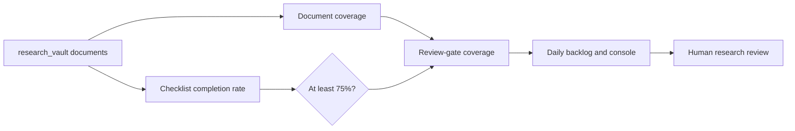

# Portfolio Analysis Coverage Review Gates

- Status: implemented
- Updated: 2026-08-20
- Authoritative root: `D:\workspace\InvestmentJournalApp`

## Objective

Show the difference between a research document being stored and a portfolio position being ready for a human investment review.

## Problem

The former coverage score treated any saved checklist file as complete. A partially completed checklist could therefore make a position look fully covered even when its human review work was still incomplete.

## Goals

- Keep the existing document-presence score for history and operational compatibility.
- Add a separate review-gate score that requires at least 75% of the 16-item checklist.
- Put both measures into the API, offline checker, daily backlog, and console result text.
- Preserve the rule that all research is decision support only; it must not submit or prepare live orders.

## Non-goals

- Creating missing team reports, trade setups, or checklist answers automatically.
- Treating generated templates, mock data, or a saved file as human approval.
- Changing portfolio quantities, brokerage settings, or external notifications.

## Contract

For each ticker, the service publishes:

- `completion_rate`: document coverage; retained for backward compatibility.
- `review_completion_rate`: coverage after the checklist review gate.
- `checklist_status`: checklist completion, readiness level, threshold, and reason.
- `review_missing_modules`: modules that still block the review gate.

`ready_count` remains the document-ready count for compatible clients. New clients should use `documented_ready_count` and `review_ready_count` explicitly.

## Daily operation

The 18:30 daily research operation writes the latest portfolio-analysis backlog after its normal research-source refresh. This is local-only bookkeeping. It does not generate reports, call an LLM, send Telegram messages, or place orders.

## Human-review evidence packets

- A packet may inventory already stored official filings, price-refresh metadata, and portfolio-sync status for one holding.
- It is produced only by explicit local-tool execution; the daily operation does not create packets automatically.
- The packet is not a team report, trade setup, earnings assessment, or checklist. It never increases document coverage or clears the human-review gate.
- If a brokerage sync says a holding is missing, the packet records that uncertainty and preserves the stored quantity until a person confirms it.

## Verification

- Unit tests cover document-only checklist presence, partial checklist rejection, and threshold acceptance.
- The offline checker verifies both scores.
- The authenticated local API and console text display both scores at desktop and 390x844 mobile widths.
