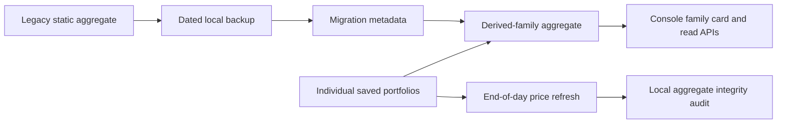

# Family Portfolio Aggregate Integrity

- Status: Implementing
- Updated: 2026-08-31
- Authoritative root: `D:\workspace\InvestmentJournalApp`

## Objective

Show `가족 합산` as a read-only, reproducible view calculated from each named
family portfolio. Individual portfolios remain the only editable holdings
records.

## Problem

The previous local store kept a separately editable `가족-합산` record beside
individual portfolios. It could become stale after a personal-account update,
which made the family view disagree with the underlying records and could also
duplicate a holding in research scopes.

## Goals

- Calculate the family aggregate on every read from individual portfolios.
- Preserve the old static aggregate in a dated local backup before migration.
- Reject direct save, deletion, account-sync, and price-persist requests for
  the derived aggregate.
- Keep all broker account records, prices, and live-order boundaries unchanged.
- Run a local integrity check after the end-of-day portfolio operation and in
  the next-sign-in catch-up path.
- Make the console label the aggregate as automatic and read-only.

## Non-goals

- Reconciling a broker account, submitting a broker order, or changing a
  family member's position automatically.
- Treating the legacy aggregate as proof of an individual account balance.
- Sending Telegram notifications or calling an LLM from the integrity check.

## Data contract

- The derived display name is `가족 합산`; normalized aliases resolve to the
  same read-only record.
- Per-ticker quantity, KRW market value, and KRW cost basis are summed from
  the individual records. Average cost and local current price use
  quantity-weighted values only when every source value is available.
- The aggregate's update time is the oldest included individual update time,
  so the view does not look fresher than its least-fresh component.
- Historical aggregate data is copied into
  `research_vault/_system/backups/` (ignored by Git) before it is removed from
  active portfolio storage. Migration metadata records its path and SHA-256.

## Safety and rollback

- The migration tool defaults to dry-run. `--apply` is required to change the
  local state file.
- It only moves a local duplicate into a backup; it never changes individual
  positions or calls an external service.
- Rollback requires an explicit human review of the dated backup. It is not an
  automatic restore because the legacy quantities may be stale.

## Operations

- `tools/check_family_portfolio_aggregate.py --write-state --strict` is
  local-only and writes a compact audit status under `research_vault/_system`.
- `tools/run_daily_research_operations.ps1` runs that check immediately after
  the normal end-of-day portfolio refresh.
- `tools/run_investment_research_catchup.ps1` runs the same check after a
  missed-day catch-up, so a PC that was off does not silently retain an invalid
  aggregate view.

## Verification

- Unit tests cover derived quantity/value calculation, legacy-static detection,
  write sanitization, and read-only endpoint behavior.
- The migration tool is dry-run checked before apply and verifies the backup
  hash after apply.
- Authenticated local API and console checks confirm that all individual cards
  plus one clearly labelled derived aggregate are available without a live
  price request.
