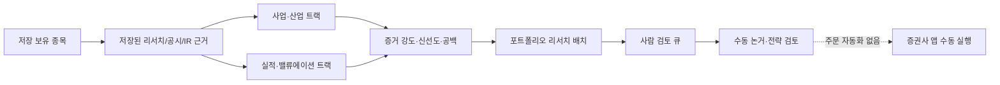

# 보유 종목 이중 트랙 리서치 배치

- 상태: 구현 중
- 작성일: 2026-08-29
- 담당 역할: 포트폴리오 증거 편집자 (`portfolio-evidence-editor`)
- 적용 루트: `D:\workspace\InvestmentJournalApp`

## 목적

저장된 보유 종목의 검증 가능한 리서치 자료를 `사업·산업`과 `실적·밸류에이션` 두 트랙으로 정리해, 사람이 읽을 수 있는 포트폴리오 단위 리서치 배치를 만든다.

## 역할 경계

| 역할 | 허용 | 금지 | 완료 기준 |
| --- | --- | --- | --- |
| 포트폴리오 증거 편집자 | 저장된 공식 공시, IR/SEC, 실적 반응, 기존 Dossier, 가격·보유 메타데이터를 분류·요약 | 외부 원천 호출, LLM 추정, 주문 호출, 체크리스트·전략의 자동 완료 | 모든 보유 종목에 두 트랙의 근거 상태와 다음 사람 검토를 표기 |
| 사람 검토자 | 원문 검증, 논거 채택·수정, 증권사 앱에서 수동 주문 | 생성된 우선순위만으로 매매 결정 | 원문·계좌·계획을 확인한 뒤 별도 전략/체크리스트에 기록 |

## 사용자 흐름

- 콘솔의 `전체 보유 종목 리서치 생성`은 선택된 카드 한 장만 보지 않고 가족 합산·개인별 저장 포트폴리오 전체를 함께 읽는다. 같은 티커가 여러 계좌에 있으면 평가금액을 합산하지 않고 가장 큰 저장값을 참조값으로 사용해 가족 합산 카드와 개인 카드의 중복 집계를 막는다.

## 트랙 규칙

- 개별 종목: 사업·산업 트랙은 사업 구조·경쟁·KPI·정책/산업 자료를, 실적·밸류에이션 트랙은 실적 반응·공시·모델 업데이트·가치평가 가정을 사용한다.
- ETF/펀드/ETN: 사업 트랙을 `기초지수·편입·산업 노출`로, 재무 트랙을 `추적 구조·보수·유동성·기초지수/수급`으로 이름만 바꾼다. ETF를 개별 기업 실적으로 단정하지 않는다. `TIGER`·`KODEX` 등 한국 ETF 브랜드는 이름에 ETF 표기가 생략돼도 펀드형으로 분류한다.
- 공통 원천: 기존 `research_vault`의 검증된 저장 자료만 사용한다. 출처 수와 가장 최근 날짜를 함께 표시한다.
- 증거 강도는 자료 존재·두 트랙 충족·최근성의 기계적 점수이며, 수익 기대·매수 신호·모델 신뢰도가 아니다.

## 완료·보관 규칙

- 생성 결과는 `research_vault/_system/portfolio_research_batches/`에 JSON과 Markdown으로 저장한다. 개인 보유정보가 포함될 수 있으므로 Git에 넣지 않는다.
- 이 배치는 `기준 리포트`, `매매 전략`, `체크리스트`의 완료 여부를 변경하지 않는다.
- 자동 주문·브로커 API·Telegram 발송·외부 LLM 호출은 하지 않는다.

## 검증

- 단위 테스트: 개별 종목/ETF 분기, 근거 공백, 최신성, Markdown 렌더링, 저장 경로.
- API: 미리보기와 저장 실행이 동일한 내용 구조를 반환하며 주문 호출 플래그는 항상 거짓이다.
- UI: 데스크톱과 390×844에서 버튼·로딩·결과 문구가 한국어 단어 단위로 표시되고 가로 오버플로가 없어야 한다.
