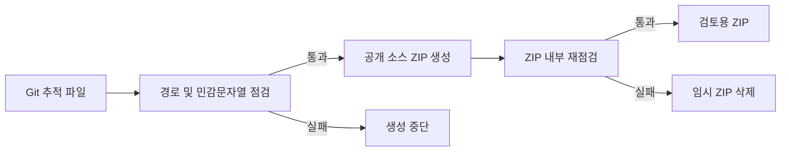

# Public Source Release Safety

- 상태: 적용
- 작성일: 2026-09-15
- 범위: Investment Research OS 공개 소스 ZIP

## 목적

공개 검토용 소스 ZIP을 만들 때 로컬 포트폴리오, 대화 내보내기, 첨부 이미지, 계정 식별값, API 키와 토큰이 함께 복사되는 일을 막는다.

## 목표와 제외 범위

- 목표: Git 추적 소스만 ZIP에 넣고, 생성 전후에 경로와 텍스트를 검사한다.
- 목표: 실패 로그에는 파일 경로만 남기며, 민감한 값 자체는 출력하지 않는다.
- 제외: 실제 API 키 폐기·재발급, GitHub Release 업로드, 외부 배포는 이 도구가 수행하지 않는다.
- 제외: 리서치 결과·DB·`research_vault`를 공개 데이터로 바꾸지 않는다.

## 흐름

## 보호 경계

- 차단 경로: `.env`, `research_vault`, token cache, DB, 키 파일, `attachments`, `backups`, 의존성 폴더와 빌드 산출물.
- 차단 내용: 개인키, 일반적인 API 키 형식, Telegram bot token 형식, Bearer token 형식, 주요 증권·외부 API 환경변수에 입력된 실제 값.
- 허용 예외: 빈값 또는 명확한 placeholder만 있는 `.env.example` 파일.

## 운영 기준

- 공개 ZIP은 `tools\build_public_source_bundle.py`로만 만든다.
- 공유·업로드 직전 `tools\check_public_repo_safety.py --archive <zip>`이 통과해야 한다.
- 기존 공개본에서 credential 의심이 나오면 새 ZIP을 만들기 전에 해당 공급자에서 폐기·재발급한다.

## 검증

- `tests\test_public_release_safety.py`는 안전한 ZIP, 첨부 경로, 실제 형태의 환경변수 값을 각각 점검한다.
- `python tools\check_public_repo_safety.py`는 현재 Git 후보를 점검한다.
- 생성 도구는 결과 ZIP을 스스로 재점검하고 실패한 임시 파일을 삭제한다.
