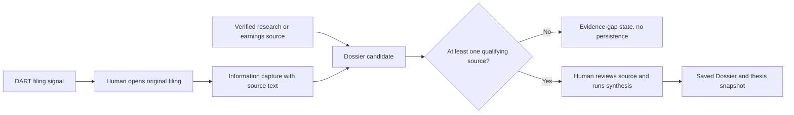

# Research Dossier Evidence Workspace

- Status: implemented
- Updated: 2026-08-21
- Author: Codex (`research-evidence UX architect`)
- Authoritative root: `D:\workspace\InvestmentJournalApp`

## Objective

Show a ticker's Dossier as an evidence-first review workspace: distinguish stored source signals from a human-reviewed investment thesis, and do not persist a generated thesis when no qualifying source exists.

## Goals

- Put the Dossier evidence state next to recent saved data and DART filing signals on the dashboard.
- Explain the difference between a DART filing signal, a Dossier source candidate, and a saved Dossier.
- Prevent the Dossier endpoint from saving fallback language, a thesis snapshot, or watch items when the qualifying source count is zero.
- Make the empty state actionable without claiming that missing evidence is a negative investment conclusion.
- Keep desktop and 390×844 mobile layouts readable with stable touch targets and no horizontal overflow.

## Non-goals

- Parsing an official filing into a conclusion without checking its original text.
- Treating a DART signal, document count, generated template, or legacy report as a verified Dossier source by itself.
- Calling an LLM, sending Telegram, modifying a brokerage account, or placing an order.
- Replacing the existing team-report, earnings, or human-review workflows.

## Evidence contract

The dashboard exposes `dossier_readiness` with:

- `candidate_source_count`: report-type candidates selected from already verified records; content quality and duplicates are checked again during synthesis.
- `stored_source_count`: source count recorded by the latest persisted Dossier.
- `filing_available` and `filing_headline`: a filing notification only, not an automatically usable conclusion.
- `status`: `ready`, `review_required`, or `insufficient_evidence`.

## Persistence gate

`POST /api/v1/dossier/{ticker}/synthesize` and `GET /api/v1/dossier/{ticker}` use the same gate. When zero unique verified sources qualify, the response is `insufficient_evidence` and includes next actions, but it does not write a Markdown report, update a thesis snapshot, or produce watch items.

## UI states

| State | Dashboard behavior | Allowed action |
| --- | --- | --- |
| `insufficient_evidence` | Show source gap and DART notice; hide synthesis as the primary action. | Open saved data or add source material. |
| `review_required` | Show candidate count and require source review disclosure. | Inspect storage, then explicitly synthesize. |
| `ready` | Show saved facts, Bull/Bear context, cruxes, and observable triggers. | Inspect evidence or refresh after reviewing new data. |

## Verification

- Unit tests cover the readiness state and no-persistence result.
- The authenticated dashboard API exposes the new readiness contract.
- Browser checks use a real ticker with filing signals but zero qualifying Dossier sources to confirm the evidence-gap state at desktop and 390×844 widths.
- Static console syntax, Python compilation, backend regression tests, asset hashes, and the Windows console verification script must pass.
