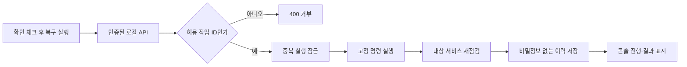

# 통합 작업대 안전 복구 설계

- 작성자: Codex
- 상태: 구현 및 로컬 검증 완료
- 작성/갱신일: 2026-07-14
- 기준 파일: `docs/design/safe-workbench-recovery.md`

## 목표

투자 리서치 콘솔에서 사용자가 상태를 확인한 뒤 허용된 로컬 서비스 복구를 한 번에 실행하고 진행·결과·이력을 확인할 수 있게 한다.

## 범위

- 허용 작업은 `전체 작업대`, `전략·백테스트`, `KIS 모의투자`, `OpenClaw` 네 가지다.
- API는 작업 ID만 받고 명령, 경로, 인자, 환경변수를 사용자 입력으로 받지 않는다.
- 실전투자 전환, 주문 제출, 외부 메시지, 배포, 임의 프로세스 실행은 비목표다.

## 실행 흐름

## 안전 경계

- 작업당 동시에 하나만 실행하고 두 번째 요청은 `409`로 거부한다.
- subprocess 출력은 API와 이력에 저장하지 않는다.
- 이력에는 작업 ID, 상태, 단계, 시각, 소요시간, 종료 코드, 복구 전후 정상 개수, 오류 코드만 저장한다.
- KIS 복구는 기존 통합 실행기의 모의투자 모드 확인을 그대로 사용하며 실전 모드이면 인증을 건너뛴다.
- OpenClaw는 기존 WSL `openclaw-gateway.service`만 시작한다.

## 운영 목표

- 시작 API는 2초 안에 작업 ID를 반환한다.
- UI는 1초 간격으로 상태를 확인하고 최대 3분 동안 진행 상태를 유지한다.
- 실행 완료 후 전체 구성요소 상태를 다시 점검한다.
- 최근 20개 이력을 로컬 Git 무시 상태 저장소에 보관한다.

## 검증

- 허용되지 않은 작업 거부, 중복 실행 거부, 성공·실패 상태 저장을 단위 테스트한다.
- 실제 `전체 작업대` 복구를 실행해 `9/9` 상태를 확인한다.
- 데스크톱과 390×844 모바일에서 확인 체크, 버튼, 진행 상태, 이력, 가로 넘침을 확인한다.
