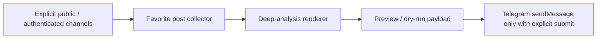

# Telegram Deep Analysis Channel Report

- Status: implemented, delivery disabled by default
- Updated: 2026-08-29
- Authoritative code: `backend/research_os/telegram_deep_analysis.py`

## Objective

Create a concise 07:00 Telegram market report from the user's explicitly configured source channels, while retaining links to the underlying posts and preventing social signals from becoming investment instructions.

## Flow



## Contract and safety

- The report includes channel/post counts, deterministic lexicon sentiment, keyword frequency, configured entity/ticker aliases, and a top-post list with source URLs.
- The `-100..100` sentiment value is an observed text signal, not a price target, recommendation, or confidence score.
- Forward counts are reported only by authenticated Telegram collection. Public `t.me/s` previews label sharing as unavailable rather than estimating it.
- `TELEGRAM_DEEP_ANALYSIS_ENABLED=false` and normal Telegram delivery dry-run remain the default. A live post additionally requires the bot to be an administrator, a configured channel chat id, and an explicit `--submit`.
- Optional aliases use `TELEGRAM_DEEP_ANALYSIS_ENTITY_ALIASES_JSON`; additionally, the runner reads the current `user_portfolios.json` holdings at execution time and merges their names as aliases. This keeps the analysis aligned with the user's portfolio without storing a duplicate list in `.env`.

## Verification

```powershell
.\.venv-win\Scripts\python.exe tools\check_telegram_deep_analysis.py --sample
.\.venv-win\Scripts\python.exe tools\check_telegram_deep_analysis.py --env-file backend\.env --live-fetch
```

The second command is still dry-run. The 07:00 task invokes `--submit`; it fails loudly instead of sending if the bot token, channel ID, `TELEGRAM_DEEP_ANALYSIS_ENABLED=true`, `TELEGRAM_BRIEF_DELIVERY_ENABLED=true`, or `TELEGRAM_BRIEF_DELIVERY_DRY_RUN=false` is missing.

For local setup, run `tools/setup_telegram_deep_analysis_env.ps1`. It prompts with hidden token input and writes only the required ignored `.env` values. Prefer `@lib20_bot` for the existing InvestmentJournalApp report path; do not paste bot tokens into chat or source-controlled files.
