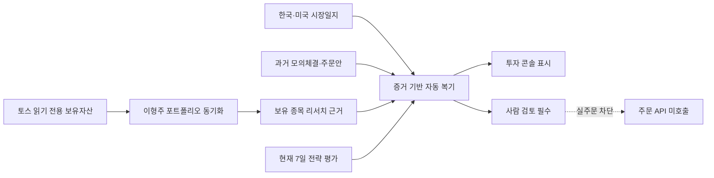

# 토스 지정 소유자·증거 기반 자동 복기

- 작성자: Codex
- 상태: 구현 중
- 작성일: 2026-08-13
- 기준 파일: `docs/design/toss-owner-evidence-review.md`

## 목적

토스증권 보유 종목을 한 명의 가족 포트폴리오에 안전하게 귀속하고, 매일 자동 복기가 구매 근거·매크로 근거·반복 패턴·현재 전략 성공률을 증거와 불확실성까지 포함해 보여주게 합니다.

## 목표와 비목표

- `TOSS_PORTFOLIO_NAME`으로 지정한 포트폴리오만 토스 계좌의 소유자로 취급합니다. 현재 운영값은 `이형주`입니다.
- 토스 원격 신규 종목은 지정 포트폴리오에 자동 편입하고, 기존의 다른 증권사·수동 종목은 보존합니다.
- 복기는 네 근거 영역을 각각 구조화하고 파일/URL/시장일지/모의체결 표본을 추적할 수 있게 합니다.
- 표본이 부족한 승률은 그대로 `insufficient_sample`로 표시합니다.
- 실제 주문, 계좌 변경, 실거래 자동 승인은 이 작업의 범위가 아닙니다.

## 증거 계약

| 영역 | 최소 근거 | 부족할 때 |
|---|---|---|
| 구매 근거 | 지정 토스 종목의 최신 리서치 또는 당일 매칭 뉴스 | `missing` |
| 매크로 근거 | 해당 종목 시장(KR/US)의 최신 시장일지 | `missing` |
| 반복 패턴 | 동일 종목·동일 방향의 과거 주문안/모의체결 | 최초면 `first_observation` |
| 전략 성공률 | 기간, 관측일, 표본 수, 승률, 수익률, 최대낙폭 | `insufficient_sample` 유지 |

## 운영·보안 기준

- 동기화 및 복기는 장 종료 후 하루 한 번 실행되며, 실패 시 성공 상태로 덮어쓰지 않습니다.
- 계좌번호, 토큰, 인증정보는 결과·로그·화면에 기록하지 않습니다.
- 목표 신선도는 마지막 장 종료 후 다음 자동 실행까지이며, 화면에는 근거 날짜와 표본 수를 표시합니다.
- 자동 결과는 투자 권고가 아니며 사람 검토 게이트를 제거하지 않습니다.
