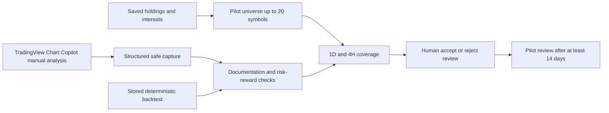

# TradingView Chart Copilot Comparison Pilot

- Author: Codex (`research-integration-auditor`)
- Status: Implemented
- Created/updated: 2026-08-15
- Authoritative path: `docs/design/tradingview-chart-copilot-pilot.md`

## Objective

Evaluate TradingView AI Chart Copilot as a human-reviewed chart-analysis assistant without replacing deterministic research, backtesting, or order safeguards.

## Goals

- Build a pilot universe from up to 20 saved portfolio and interest-list symbols.
- Capture structured 1D and 4H observations with traceable prompt and analysis timestamps.
- Compare every captured observation with the latest matching stored backtest when one exists.
- Measure documentation quality, coverage, elapsed observation days, and human-review completion.
- Keep all brokerage accounts, quantities, credentials, and live-order operations outside the feature.

## Non-goals

- Automating or reverse-engineering the browser extension.
- Treating an LLM chart annotation as a validated signal.
- Generating, submitting, amending, or cancelling brokerage orders.
- Replacing the daily SMA validation or local backtester.
- Claiming predictive accuracy before the cohort and observation-window gates are met.

## Workflow

## Interface contract

### `GET /api/v1/chart-copilot-pilot`

Returns the pilot configuration, portfolio/interest target universe, coverage, elapsed days, recent evaluations, and the safe prompt template.

### `POST /api/v1/chart-copilot-pilot/evaluations`

Accepts only secret-free research fields:

- ticker, market, analysis timestamp, prompt profile/version, and 1D/4H timeframes
- regime, decision, confidence, support/resistance, entry/stop/target
- evidence, invalidation, alternative scenario, missing data, and human verdict
- optional stored backtest run identifier

Unknown fields are rejected. Obvious credential markers are rejected. The response labels its score as documentation quality, not prediction confidence.

## Evaluation gates

- Universe target: 20 distinct portfolio/interest symbols when available.
- Timeframe target: both 1D and 4H for each target.
- Observation window: at least 14 days; continue up to 28 days for weak or mixed evidence.
- Review gate: every evaluation remains research-only and requires an explicit human verdict.
- Backtest gate: a linked backtest is supporting evidence only; its historical return is not converted into an order signal.

## Security and privacy

- The browser extension is opened separately and is never given account identifiers, holdings quantities, tokens, or brokerage credentials by Research OS.
- The backend store is limited to structured research observations under `research_vault/_system`.
- The API contains no live-order endpoint and does not call Strategy Builder execution routes.
- Prompt text explicitly permits `no_trade` and requires missing-data disclosure.

## Failure states

- No matching backtest: save the observation with an `unlinked` comparison and a remediation note.
- Missing setup fields or invalid risk/reward: save as incomplete evidence; do not infer missing prices.
- Insufficient cohort or elapsed days: report `collecting`, not pass/fail.
- Sensitive marker detected: reject the request with no persisted record.
- Extension unavailable or rate-limited: deterministic daily validation remains unaffected.

## Verification

- Unit-test risk/reward, backtest linkage, secret rejection, and the 20-symbol/14-day readiness gate.
- Run the classic console static contract and focused browser smoke checks.
- Check desktop and 390x844 layouts for wrapping, form usability, empty/error states, and touch targets.
- Run `git diff --check` and the existing research-console verification path.

## Open issues

- TradingView does not expose a supported Chart Copilot automation API in the reviewed material. Manual capture remains the safe boundary.
- Predictive outcome scoring requires a later design that fixes evaluation horizons and market-data provenance before any automated accuracy claim.
