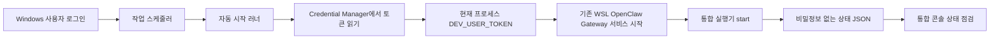

# Windows 로그인 자동 시작 보안 설계

- 작성자: Codex
- 상태: 구현 및 로컬 검증 완료
- 작성/갱신일: 2026-08-28
- 기준 파일: `docs/design/windows-autostart-security.md`

## 목표

Windows 로그인 후 투자 리서치 OS 통합 작업대를 자동으로 복구하되 개발 토큰을 작업 스케줄러 인자, 스크립트, 로그, 상태 API에 남기지 않는다.

## 목표와 비목표

- Windows Credential Manager의 현재 사용자 범위에 `DEV_USER_TOKEN`을 저장한다.
- 로그인 트리거는 중복 실행을 무시하고 실패 상태를 로컬 상태 파일에 기록한다.
- 전략/백테스트/KIS는 기존 통합 실행기의 안전 경계를 그대로 사용한다.
- 실전투자 전환, 주문 제출, 관리자 권한 실행, 외부 전송은 범위에 포함하지 않는다.

## 실행 흐름

## 보안 경계

- 자격 증명 대상 이름만 작업 스케줄러 인자에 저장한다.
- 토큰은 현재 Windows 사용자 세션에서만 읽고 러너 종료 전 환경변수와 지역 변수를 제거한다.
- 로그와 상태 JSON에는 성공 여부, 시각, 종료 코드, 구성요소 개수만 기록한다.
- 작업은 현재 사용자, `Interactive`, 제한된 권한으로 등록한다.
- OpenClaw는 이미 등록되고 활성화된 `openclaw-gateway.service`만 시작한다. 새로운 서비스나 임의 명령은 만들지 않는다.
- WSL 유지 클라이언트는 shell 문자열을 `bash -lc`로 전달하지 않고, root의 직접 `sleep` 실행으로 유지한다. 이는 작업 스케줄러의 인자 평탄화로 keepalive가 즉시 종료되는 문제를 막는다.
- 작업 명령줄에 토큰, 계좌번호, 증권사 키가 포함되면 상태 점검을 실패 처리한다.

## 운영 목표와 검증

- 로그인 후 2분 안에 러너가 시작되어야 한다.
- 같은 작업이 실행 중이면 새 인스턴스를 만들지 않는다.
- 수동 작업 실행 후 작업 결과 코드가 성공이고 통합 상태 API가 응답해야 한다.
- 자격 증명 미설정, 작업 누락, 최근 러너 실패는 통합 콘솔에서 `주의 필요`로 표시한다.

## 롤백

작업 스케줄러 항목을 해제하거나 삭제하고 Credential Manager 대상 항목을 삭제한다. 기존 수동 실행기와 백엔드 watchdog은 영향을 받지 않는다.
