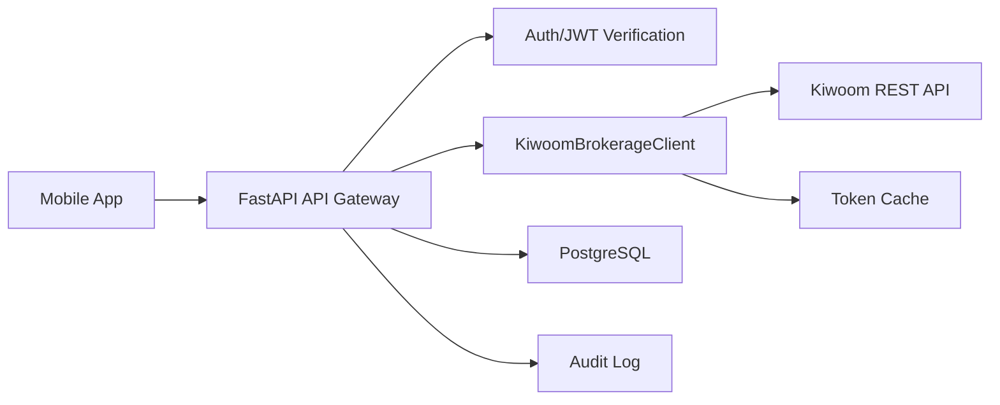

# 키움증권 우선 연동 설계

작성일: 2026-05-07

## 1. 선택 기준

첫 증권사 연동 대상은 키움증권으로 확정한다. 백엔드는 키움증권 Adapter를 먼저 구현하고, 한국투자증권은 같은 `BrokerageClient` 인터페이스를 따르는 후속 Adapter로 추가한다.

## 2. 공식 절차에서 반영할 운영 조건

키움 REST API 공식 이용안내 기준으로 다음 조건을 설계에 반영한다.

- 키움 REST API 사용 전 키움증권 계좌와 API 사용 신청이 필요하다.
- 실제 투자와 모의투자 App Key는 별도로 관리한다.
- API 인증에 사용할 IP 등록이 필요하며, 운영 서버의 고정 IP 또는 NAT Gateway IP를 등록해야 한다.
- App Key와 App Secret은 백엔드 Secret 저장소에만 저장한다.
- 접근 토큰은 OAuth 2.0 Client Credentials 방식으로 발급하고, 만료 전에 백엔드에서 갱신한다.

참고: [키움 REST API 이용안내](https://openapi.kiwoom.com/intro/serviceInfo)

## 3. 현재 화면 기준 체크리스트

첨부 화면은 키움 REST API의 `계좌 APP KEY 관리` 페이지다. 이 화면에서는 먼저 허용 IP를 등록한 뒤 계좌별 App Key/App Secret을 발급하거나 확인하는 흐름으로 진행한다.

### IP 등록

- `현재 나의 IP`에 표시된 공인 IP를 `IP 주소등록` 입력란에 넣고 `추가`한다.
- 로컬 개발 중에는 현재 PC가 사용하는 공인 IP를 등록한다.
- 집/사무실 인터넷처럼 공인 IP가 바뀔 수 있는 환경에서는 API 호출이 갑자기 실패할 수 있다.
- 운영 배포 시에는 서버의 고정 outbound IP를 등록한다. 클라우드에서는 NAT Gateway, 고정 Elastic IP, 고정 egress IP 구성이 필요하다.
- 최대 등록 가능 개수가 제한되어 있으므로 사용하지 않는 IP는 삭제한다.

### App Key/App Secret

- 화면 하단의 계좌별 목록에서 `App Key App Secret` 항목을 발급 또는 확인한다.
- 실전투자와 모의투자 키는 반드시 분리해서 관리한다.
- 키는 모바일 앱에 넣지 않고 백엔드 환경 변수 또는 Secret Manager에만 저장한다.
- 공유 화면, 로그, 이슈, 문서에 App Secret 원문을 남기지 않는다.

### 다운로드

- 키움에서 제공하는 다운로드 파일이 있으면 로컬 보관용으로만 사용한다.
- 앱 저장소에는 업로드하지 않는다.
- 필요한 값만 `.env` 또는 배포 Secret Manager에 옮겨 적는다.

## 4. 권장 백엔드 구성



## 5. 키움 Adapter 책임

`KiwoomBrokerageClient`는 다음 책임을 가진다.

- 키움 접근 토큰 발급 및 갱신
- 체결 내역 조회
- 잔고 및 보유 종목 조회
- 키움 원천 응답을 `NormalizedTrade`로 변환
- 키움 체결 ID 기준 중복 방지
- 장애 발생 시 사용자에게 마지막 동기화 상태 제공

## 6. 토큰 관리 권장 방식

- 모바일 앱은 키움 토큰을 절대 보유하지 않는다.
- 백엔드는 사용자 인증 JWT와 키움 API 토큰을 분리해서 관리한다.
- 키움 접근 토큰은 서버 캐시 또는 DB에 암호화 저장한다.
- 토큰 만료 전에 백엔드가 재발급한다.
- 토큰 발급 실패는 거래 조회 실패와 구분해서 로그에 남긴다.

## 7. 데이터 저장 범위

저장한다:

- 정규화된 거래 데이터
- 증권사 체결 ID
- 증권사 주문 ID
- 원천 응답 해시
- 동기화 시각
- 오류 코드와 마스킹된 오류 메시지

저장하지 않는다:

- App Secret 원문
- 접근 토큰 평문
- 계좌 비밀번호
- 전체 원천 응답
- 모바일 클라이언트 로그의 계좌번호 원문

## 8. 환경 변수

```text
DEFAULT_BROKER=KIWOOM
KIWOOM_API_KEY=********
KIWOOM_API_SECRET=********
KIWOOM_BASE_URL=https://api.kiwoom.com
KIWOOM_MOCK_BASE_URL=https://mockapi.kiwoom.com
KIWOOM_USE_MOCK=true
KIWOOM_REGISTERED_IP=********
SECRET_SALT=********
```

## 9. OAuth 토큰 발급 테스트

키움 공식 API 가이드 기준 접근토큰발급 TR은 `au10001`이며, `POST /oauth2/token`으로 호출한다. 요청 본문은 `grant_type=client_credentials`, `appkey`, `secretkey`를 포함한다.

로컬 `.env`에 발급받은 키를 넣은 뒤 서버를 실행한다.

```powershell
cd InvestmentJournalApp\backend
Copy-Item .env.example .env
# .env 파일의 KIWOOM_API_KEY, KIWOOM_API_SECRET을 실제 값으로 교체
uvicorn main:app --reload
```

토큰 테스트 엔드포인트:

```http
POST /api/v1/brokerage/kiwoom/token-test
Authorization: Bearer dev-local-token
```

이 엔드포인트는 실제 접근 토큰을 그대로 반환하지 않고 마스킹된 토큰, 만료 시각, 응답 코드만 반환한다.

참고: [키움 REST API 접근토큰발급](https://openapi.kiwoom.com/guide/apiguide)

## 10. 로컬 트러블슈팅 기록

- Python 3.14에서는 Pydantic 2.11 계열의 `pydantic-core` 빌드가 실패할 수 있으므로 Pydantic 2.13 이상을 사용한다.
- Windows 시스템 프록시 설정 때문에 키움 서버 연결이 거부될 수 있어 키움 API HTTP 호출에는 `trust_env=False`를 적용한다.
- `uvicorn.exe`가 PATH에 없을 수 있으므로 서버 실행은 `python -m uvicorn main:app --reload` 방식을 권장한다.

## 11. 계좌번호조회 테스트

키움 공식 API 가이드 기준 계좌번호조회 TR은 `ka00001`이며, `POST /api/dostk/acnt`로 호출한다. 요청 바디는 `{}`이고, 헤더에는 `authorization`, `api-id=ka00001`, `cont-yn`, `next-key`를 포함한다.

토큰 테스트가 성공한 뒤 아래 엔드포인트로 계좌 조회 연결을 확인한다.

```http
POST /api/v1/brokerage/kiwoom/accounts-test
Authorization: Bearer dev-local-token
```

이 엔드포인트는 실제 계좌번호를 그대로 반환하지 않고 마스킹된 계좌번호와 응답 키 목록만 반환한다. 실제 계좌번호는 향후 서버 내부 DB에 암호화 저장하거나 사용자별 증권사 연결 설정에서만 참조한다.

참고: [키움 REST API 계좌번호조회](https://openapi.kiwoom.com/m/guide/apiguide?jobTpCode=08)

## 12. 잔고/보유종목 조회 테스트

보유 종목 화면의 기본 데이터는 `계좌평가잔고내역요청 kt00018`을 사용한다. 키움 계좌 API는 같은 URL `/api/dostk/acnt`를 사용하고, 헤더의 `api-id`로 실제 TR을 구분한다.

요청:

```http
POST /api/v1/brokerage/kiwoom/balance-test
Authorization: Bearer dev-local-token
```

백엔드가 키움에 보내는 주요 값:

```json
{
  "api-id": "kt00018",
  "body": {
    "qry_tp": "1",
    "dmst_stex_tp": "KRX"
  }
}
```

응답은 앱에서 쓰기 편하도록 `summary`와 `holdings`로 정규화한다. 다음 단계에서 이 응답을 DB의 현재 포지션 스냅샷으로 저장하고 모바일 포트폴리오 화면에 연결한다.

참고: [키움 REST API 계좌 API 가이드](https://openapi.kiwoom.com/m/guide/apiguide?jobTpCode=08)

## 13. 당일매매일지 조회 테스트

매매일지 자동 생성의 1차 원천 데이터는 `당일매매일지요청 ka10170`을 사용한다. 이 API는 당일 매수/매도 요약, 손익금액, 수수료/세금, 종목별 매수/매도 금액을 제공한다.

요청:

```http
POST /api/v1/brokerage/kiwoom/trade-journal-test
Authorization: Bearer dev-local-token
```

백엔드가 키움에 보내는 주요 값:

```json
{
  "api-id": "ka10170",
  "body": {
    "base_dt": "",
    "ottks_tp": "1",
    "ch_crd_tp": "0"
  }
}
```

`base_dt`를 비우면 금일 데이터가 조회된다. 키움 문서 기준 최근 2개월까지 조회 가능하므로, 추후에는 날짜 파라미터를 받아 과거 매매일지도 동기화할 수 있게 확장한다.

참고: [키움 REST API 계좌 API 가이드](https://openapi.kiwoom.com/m/guide/apiguide?jobTpCode=08)

## 14. 주문/체결 상세 조회 테스트

체결 단위 원장 데이터는 `계좌별주문체결내역상세요청 kt00007`을 사용한다. `ka10170`이 당일 매매 요약이라면, `kt00007`은 주문번호, 주문시간, 체결단가, 체결수량, 주문잔량을 포함하므로 매매일지의 원천 거래 단위로 적합하다.

요청:

```http
POST /api/v1/brokerage/kiwoom/order-executions-test
Authorization: Bearer dev-local-token
```

백엔드가 키움에 보내는 주요 값:

```json
{
  "api-id": "kt00007",
  "body": {
    "ord_dt": "",
    "qry_tp": "4",
    "stk_bond_tp": "0",
    "sell_tp": "0",
    "stk_cd": "",
    "fr_ord_no": "",
    "dmst_stex_tp": "%"
  }
}
```

`qry_tp=4`는 체결내역만 조회하기 위한 값이다. 추후 미체결 주문 관리가 필요하면 `qry_tp=3` 또는 주문 상태별 별도 엔드포인트를 추가한다.

참고: [키움 REST API 계좌 API 가이드](https://openapi.kiwoom.com/m/guide/apiguide?jobTpCode=08)

## 15. 키움 동기화 저장 테스트

키움에서 조회한 포트폴리오와 매매일지 원천 데이터를 로컬 DB에 저장한다.

요청:

```http
POST /api/v1/sync/kiwoom
Authorization: Bearer dev-local-token
```

확인 API:

```http
GET /api/v1/sync/latest
GET /api/v1/journal/drafts
```

로컬 DB 파일:

```text
backend/investment_journal.sqlite3
```

현재 저장 범위:

- 동기화 실행 이력
- 포트폴리오 스냅샷
- 매매일지 초안

실제 계좌번호, 키움 접근 토큰, App Secret 원문은 저장하지 않는다.

## 16. 구현 순서

1. Mock 기반 `KiwoomBrokerageClient` 유지
2. 키움 OAuth 토큰 발급 모듈 추가
3. 계좌번호조회 모듈 추가
4. 계좌평가잔고내역 모듈 추가
5. 당일매매일지 모듈 추가
6. 주문/체결 상세 조회 모듈 추가
7. 원천 응답 정규화 테스트 작성
8. 로컬 SQLite에 동기화 이력 저장
9. 모바일 앱에서 마지막 동기화 상태 표시
10. 운영 PostgreSQL 전환 준비
11. 모의투자 환경으로 E2E 검증
12. 실제 투자 API 전환 전 권한, IP, 감사 로그 점검
