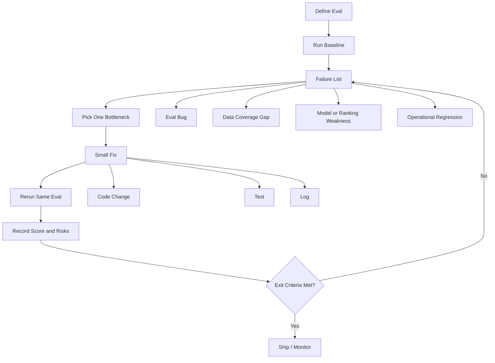

# Eval-Driven Improvement Loop Report

## Executive Summary

Eval-driven improvement loop는 제품이나 시스템을 "좋아 보이게" 고치는 방식이 아니라, 먼저 평가 기준을 만들고 그 기준이 드러내는 가장 큰 병목을 하나씩 줄이는 운영 방식이다. 핵심은 `baseline -> failure list -> one bottleneck fix -> rerun eval -> log`의 반복이다.

이 프로젝트의 추천 정확도 개선 작업에서는 새 평가 도구로 baseline `80.00/100`을 기록했고, 병목을 순서대로 분리했다. 첫 번째는 평가 도구가 문자열 벌점을 잘못 읽는 문제였고, 두 번째와 세 번째는 추천 추적 가격 커버리지 문제였다. 가격 누락은 `45 -> 0`으로 줄었고 점수는 `84.74/100`까지 개선됐다. 마지막으로 과거 성과가 나쁜 종목을 다음 추천에서 감점하는 피드백 루프를 추가했다.

근거와 한계를 분리하면 더 선명하다. 근거는 평가 점수, 실패 목록, 테스트 통과, 운영 검증 통과처럼 관측 가능한 산출물이다. 한계는 과거 추천 성과 자체는 코드 변경으로 바꿀 수 없고, 실제 hit rate 개선은 다음 추천과 후속 마일스톤이 쌓인 뒤에야 확인된다는 점이다.

## Core Problem

추천 정확도 개선은 단순히 추천 점수를 높이는 문제가 아니다. 운영 시스템에서는 다음 문제가 섞인다.

- 평가 기준 자체가 틀릴 수 있다.
- 추천 데이터는 정상인데 추적 데이터가 비어 있을 수 있다.
- 추적 데이터는 채워졌지만 실제 성과가 낮을 수 있다.
- 과거 성과를 조작하면 점수는 오르지만 시스템은 더 나빠진다.

따라서 먼저 "무엇이 실패인가"를 기계적으로 확인할 수 있어야 한다. 이 프로젝트에서는 `tools/evaluate_daily_recommendation_accuracy.py`가 그 역할을 한다. 이 도구는 추천 저장소를 읽고 `latest_quality`와 `tracked_outcomes`로 나누어 점수와 실패 목록을 출력한다.

## Method

Eval-driven loop의 운영 절차는 다음과 같다.

1. Baseline을 기록한다.
2. 실패 목록을 해석하되, 추측으로 여러 문제를 동시에 고치지 않는다.
3. 가장 큰 병목 하나를 고른다.
4. 코드나 데이터 파이프라인을 작게 수정한다.
5. 같은 평가 명령을 다시 실행한다.
6. 점수, 변경점, 남은 리스크를 로그로 남긴다.
7. 반복한다.

이번 프로젝트에서는 `docs/daily-recommendation-accuracy-eval.md`가 반복 로그 역할을 한다.

## Key Claims

| Claim | 근거 | 한계 |
|---|---|---|
| 평가 도구가 있어야 개선 방향이 흔들리지 않는다. | baseline `80.00/100`, 실패 목록 3개가 명확히 출력됐다. | 평가 도구 자체도 버그가 있을 수 있으므로 store validator와 교차 검증이 필요하다. |
| 데이터 커버리지 병목은 추천 품질 병목과 다르다. | 가격 누락을 `45 -> 0`으로 줄였지만 hit rate 문제는 남았다. | 가격 coverage가 높아져도 추천 성과가 좋아지는 것은 아니다. |
| 과거 성과는 다시 쓰지 말고 다음 추천에 피드백해야 한다. | historical eval은 `84.74/100` 유지, underperformance penalty는 미래 후보 랭킹에 반영된다. | 효과는 다음 추천과 7d/15d/1m 마일스톤 이후에만 검증된다. |
| 한 번에 하나의 병목만 고치면 원인-결과 추적이 쉬워진다. | penalty parser, saved portfolio fallback, Naver domestic fallback, underperformance loop가 각각 분리 기록됐다. | 병목 간 상호작용이 있을 때 전체 최적화 속도는 느릴 수 있다. |

## Key Terms

- **Eval**: 시스템 출력이나 저장 상태를 정량/정성 기준으로 검사하는 평가 명령 또는 스크립트.
- **Baseline**: 수정 전 평가 점수와 실패 목록. 이후 변화의 기준점.
- **Failure List**: 평가가 발견한 구체적인 실패 항목. 예: `price_unavailable 45개`.
- **Bottleneck**: 현재 점수를 가장 크게 막는 단일 문제.
- **Regression Test**: 수정한 문제가 다시 생기지 않도록 고정하는 테스트.
- **Operational Store**: 시스템이 실제 운영에 사용하는 JSON/DB 상태. 이 프로젝트에서는 `research_vault/_system/daily_recommendations.json` 등이 해당한다.
- **Read-only Eval**: 운영 저장소를 바꾸지 않고 점수와 실패만 계산하는 평가.
- **Feedback Loop**: 과거 결과를 다음 의사결정에 반영하는 구조. 여기서는 과거 추적 성과가 나쁜 티커를 다음 추천에서 감점한다.
- **Hit Rate**: 완료된 추적 마일스톤 중 긍정/중립 성과 비율을 반영한 성과 지표.

## Concept Map



## Important Formulas And Examples

### Hit Rate

```text
hit_rate = (positive_count + 0.5 * flat_count) / completed_count
```

이 방식은 강한 상승만 성공으로 보고, 작은 변동은 절반 성공으로 처리한다. 장점은 단순하고 운영 대시보드에 설명하기 쉽다는 점이다. 한계는 시장 전체 하락, 섹터 베타, 추천 기간별 기대 수익률 차이를 반영하지 못한다.

### Score Decomposition

```text
total_score = latest_quality + tracked_outcomes
latest_quality max = 80
tracked_outcomes max = 20
```

이 구조는 추천 저장 품질과 실제 성과를 분리한다. 이번 작업에서 최신 추천 품질은 이미 80점 만점이었고, 남은 점수 병목은 성과 추적 쪽이었다.

### Underperformance Penalty

```text
if completed_count >= 2 and hit_rate < 0.25 and average_change_pct <= -5%:
    penalty = 12
elif completed_count >= 2 and hit_rate < 0.40 and average_change_pct < 0:
    penalty = 6
```

이 규칙은 과거 성과가 반복적으로 나쁜 종목을 무조건 배제하지 않고 감점한다. 장점은 좋은 신규 근거가 있으면 다시 올라올 여지를 남긴다는 점이다. 한계는 시장 전체 또는 섹터 전체 약세를 충분히 보정하지 못한다.

## Evidence Table

| Iteration | Problem | Action | Observed Result |
|---|---|---|---|
| Baseline | 추천 정확도 점수와 실패 목록이 없었다. | `evaluate_daily_recommendation_accuracy.py` 추가 | baseline `80.00/100` |
| 1 | 문자열 벌점 `(-2)`를 eval이 못 읽었다. | 벌점 parser 수정 | false `score_alignment` 실패 제거 |
| 2 | provider 실패 시 가격 추적 45개 누락 | 저장 포트폴리오 가격 fallback 추가 | `price_unavailable 45 -> 2`, score `83.91` |
| 3 | 포트폴리오에 없는 국내 티커 071050 가격 누락 | Naver domestic basic price fallback 추가 | `price_unavailable 2 -> 0`, score `84.74` |
| 4 | 가격 커버리지 이후에도 hit rate 낮음 | 과거 부진 티커 감점 loop 추가 | 과거 점수 유지, 미래 추천에 피드백 반영 |

## External Sources

No external paper, URL, or third-party explanation was used for this report. The claims above are separated as follows.

- **Local evidence**: commands, scores, failure lists, and implementation logs from this repository.
- **General method explanation**: engineering practice distilled from the local workflow, not a quoted external source.

If an external paper or URL is provided later, its original claims should be added in a separate section and not mixed with local implementation observations.

## Caveats / Open Questions

- Current eval is useful for 운영 readiness, but it is not a statistically rigorous investment alpha measurement.
- Hit rate does not yet control for market beta, sector movement, volatility, or benchmark-relative return.
- The feedback penalty can reduce repeated weak picks, but it may also suppress legitimate turnaround opportunities.
- Price fallback uses latest available price for due milestones. For precise historical performance, target-date close prices would be better.
- The evaluation score can plateau if `latest_quality` is capped and `tracked_outcomes` depends on future elapsed time.
- A higher score does not mean the recommendation is suitable for trading without human review.

## Next Reading Or Experiments

1. Add benchmark-relative outcome scoring: compare each recommendation to KOSPI/KOSDAQ/NASDAQ or sector ETF over the same horizon.
2. Split hit rate by horizon: 7d, 15d, 1m, 3m, 6m may need different thresholds.
3. Add confidence intervals or minimum sample-size warnings for low-count tickers.
4. Run a backtest-style replay: regenerate daily top 3 with and without underperformance feedback and compare subsequent outcomes.
5. Add a "turnaround override" rule: allow underperformers to recover ranking only when fresh evidence exceeds a higher threshold.
6. Add a report view showing why a ticker was penalized, not just the final score.
